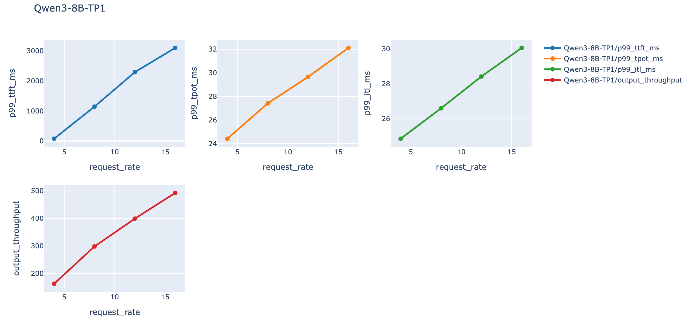
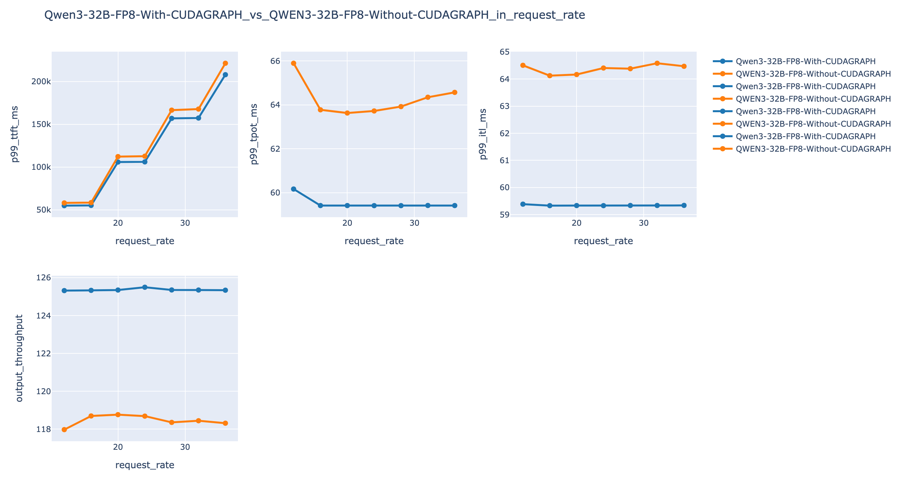
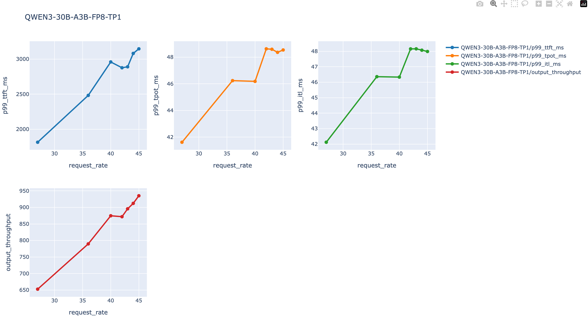

<div align="center">


  [](https://github.com/Muqi1029/ai_infra_bench/blob/main/LICENSE) [](https://img.shields.io/badge/python-3.10+-blue) []( https://pypi.org/project/ai-infra-bench/)
</div>

# Motivation

As large language model (LLMs) grow more capable, industries are eager to deploy them locally to ensure data security, reduce costs, and integrate them into daily workflows -- such as building agents that can perform comprehensive analyses to improve efficiency.

Thus, the question of how to deploy LLMs efficiently has become a critical challenge for many companies. Here, we focus solely on the benchmarking perspective -- while workload-specific optimization is a core topic, we leave it aside for simplicity as it is beyond the scope of this project. Practitioners in AI infrastructure often need to benchmark models or deployment startegies to determine whether they meet the service-level objectives (SLOs) of a particular business.

Benchmarking is often done by repeatedly running benchmark scripts (e.g., SGLang's `bench_serving`) and manually copying the resulting metrics into tables or plots for comparison. This process is tedious, error-prone, and highly repetitive. An alternative is to write custom shell scripts, but they are difficult to reuse and lack the flexibility and expressive power of modern programming language like Python.

This project aims to free AI infrastructure engineers from repetitive benchmarking tasks. Simply define your server and client launch scripts in a single python file, and the tool will automatically generate clear Markdown tables and elegant HTML plots. The entire process is fully automated -- you can focus on other work while the script run!

# Overview

There are totally 3 modes when benchmarking from the viewpoint of ai infra workers

1. **General**: Evaluate the performance of a single deployment across various workloads.
2. **Cmp**: Compare the performance of multiple deployment options in the same workload.
3. **SLO**: Identify the most demanding workload that still meets the required service-level objectives given a deployment option.

This project automatically generates benchmarking results as clean Markdown tables and interactive HTML graphs for clear visualization. Below are some example outputs.

## General Bench

### Table

Title: **Qwen3-8B-TP1**
| request_rate |     | p99_ttft_ms | p99_tpot_ms | p99_itl_ms | output_throughput |
| ------------ | --- | ----------- | ----------- | ---------- | ----------------- |
| 4.00         |     | 77.49       | 24.41       | 24.86      | 163.37            |
| 8.00         |     | 1145.30     | 27.41       | 26.60      | 298.41            |
| 12.00        |     | 2290.93     | 29.66       | 28.42      | 399.15            |
| 16.00        |     | 3100.51     | 32.12       | 30.06      | 492.53            |

### Plot



## Cmp Bench

### Table
Metric: **p99_ttft_ms**
| request_rate |     | Qwen3-32B-FP8-With-CUDAGRAPH | QWEN3-32B-FP8-Without-CUDAGRAPH |
| ------------ | --- | ---------------------------- | ------------------------------- |
| 12.00        |     | 54963.08                     | 58177.51                        |
| 16.00        |     | 55300.19                     | 58545.89                        |
| 20.00        |     | 105988.45                    | 112344.49                       |
| 24.00        |     | 106190.07                    | 112756.17                       |
| 28.00        |     | 157047.98                    | 166668.61                       |
| 32.00        |     | 157452.81                    | 167846.66                       |
| 36.00        |     | 208123.38                    | 221496.96                       |


Metric: **p99_tpot_ms**
| request_rate |     | Qwen3-32B-FP8-With-CUDAGRAPH | QWEN3-32B-FP8-Without-CUDAGRAPH |
| ------------ | --- | ---------------------------- | ------------------------------- |
| 12.00        |     | 60.17                        | 65.90                           |
| 16.00        |     | 59.42                        | 63.78                           |
| 20.00        |     | 59.42                        | 63.63                           |
| 24.00        |     | 59.42                        | 63.73                           |
| 28.00        |     | 59.42                        | 63.93                           |
| 32.00        |     | 59.42                        | 64.35                           |
| 36.00        |     | 59.42                        | 64.57                           |


Metric: **p99_itl_ms**
| request_rate |     | Qwen3-32B-FP8-With-CUDAGRAPH | QWEN3-32B-FP8-Without-CUDAGRAPH |
| ------------ | --- | ---------------------------- | ------------------------------- |
| 12.00        |     | 59.39                        | 64.51                           |
| 16.00        |     | 59.33                        | 64.13                           |
| 20.00        |     | 59.33                        | 64.17                           |
| 24.00        |     | 59.33                        | 64.41                           |
| 28.00        |     | 59.34                        | 64.38                           |
| 32.00        |     | 59.33                        | 64.59                           |
| 36.00        |     | 59.34                        | 64.47                           |


Metric: **output_throughput**
| request_rate |     | Qwen3-32B-FP8-With-CUDAGRAPH | QWEN3-32B-FP8-Without-CUDAGRAPH |
| ------------ | --- | ---------------------------- | ------------------------------- |
| 12.00        |     | 125.32                       | 117.98                          |
| 16.00        |     | 125.33                       | 118.70                          |
| 20.00        |     | 125.35                       | 118.77                          |
| 24.00        |     | 125.50                       | 118.69                          |
| 28.00        |     | 125.35                       | 118.36                          |
| 32.00        |     | 125.35                       | 118.45                          |
| 36.00        |     | 125.34                       | 118.31                          |


### Plot


## Slo Bench

### Table
Title: **QWEN3-30B-A3B-FP8-TP1**
| request_rate |     | p99_ttft_ms | p99_tpot_ms | p99_itl_ms | output_throughput |
| ------------ | --- | ----------- | ----------- | ---------- | ----------------- |
| 27.00        |     | 1813.80     | 41.61       | 42.12      | 652.56            |
| 36.00        |     | 2482.11     | 46.24       | 46.36      | 789.62            |
| 40.00        |     | 2958.86     | 46.18       | 46.33      | 874.70            |
| 42.00        |     | 2876.21     | 48.62       | 48.16      | 871.91            |
| 43.00        |     | 2889.78     | 48.59       | 48.16      | 895.68            |
| 44.00        |     | 3080.99     | 48.36       | 48.07      | 912.25            |
| 45.00        |     | 3146.45     | 48.54       | 47.99      | 935.28            |

### Plot


# Install

```py
pip install ai-infra-bench
```

# How to use

Concrete usage examples and argument configurations can be found in the [examples subdirectory](./examples)

## Eval Dataset

`aib eval-dataset` evaluates correctness against an OpenAI-compatible endpoint.
The built-in HTTP datasets are GSM8K, AIME 2025, and constrained decoding.
Install the packaged datasets and run all HTTP evaluations with:

```bash
pip install 'ai-infra-bench[data]'
aib eval-dataset \
  --evals all \
  --base-url http://localhost:9090 \
  --api-key EMPTY \
  --model your-model \
  --max-concurrency 32
```

Use `--num-questions` for a smaller smoke test, `--repeat` for repeated rounds,
and `--override-payload` for JSON request overrides. A custom dataset YAML or
dataset path can be used when exactly one HTTP evaluation is selected.

### DeepSWE

DeepSWE is a long-horizon coding-agent benchmark. Unlike the question-answer
datasets, it runs each task in an isolated repository environment and grades the
agent's committed patch with the benchmark's program-based verifier. AIB uses
the official [Pier](https://github.com/datacurve-ai/pier) runner for this path.

Install the runner and clone the benchmark tasks:

```bash
pip install ai-infra-bench
uv tool install --python 3.12 datacurve-pier
git clone https://github.com/datacurve-ai/deep-swe
```

Pier 0.3.0 requires Python 3.12 and either Docker or a configured Modal account;
installing it as a tool keeps AIB compatible with Python 3.10+. When AIB already
runs on Python 3.12, `pip install 'ai-infra-bench[deepswe]'` is also supported.

Run a deterministic ten-task sample against an OpenAI-compatible endpoint:

```bash
aib eval-dataset \
  --evals deepswe \
  --dataset-path ./deep-swe/tasks \
  --model openai/your-model \
  --base-url http://localhost:9090 \
  --api-key EMPTY \
  --max-concurrency 1 \
  --num-questions 10 \
  --deepswe-jobs-dir ./deepswe-jobs
```

`--repeat` maps to Pier attempts per task. `--max-concurrency` controls concurrent
sandbox trials, and `--num-questions` selects a deterministic subset (seed 0 by
default). Use `--deepswe-environment modal` for Modal instead of local Docker,
or `--config` to pass a full Pier job configuration. DeepSWE is intentionally
excluded from `--evals all` because it launches long-running sandbox jobs.

## Metrics Scraping

`aib metrics` continuously polls the Prometheus-format `/metrics` endpoints of
inference pods (e.g. SGLang launched with `--enable-metrics`), stores every
sample locally, and draws interactive charts. New pod IPs can be added at any
time without restarting. Everything runs in a single process -- no Docker, no
external Prometheus.

```bash
# scrape two SGLang pods every second, store samples and render charts
aib metrics --urls 10.0.0.5:30000 10.0.0.6:30000 --output-dir metrics_out

# serve the live chart page AND an embedded Prometheus-compatible API
aib metrics --urls 10.0.0.5:30000 --db metrics.db --serve
```

The embedded API speaks the Prometheus HTTP API (a small PromQL subset:
selectors, `rate()`, `histogram_quantile()`, `sum/avg/min/max/count by`,
arithmetic) over the scraped history:

```bash
curl -G http://127.0.0.1:8765/api/v1/query \
  --data-urlencode 'query=rate(sglang:num_requests_total[2m])'
curl -G http://127.0.0.1:8765/api/v1/query_range \
  --data-urlencode 'query=histogram_quantile(0.99, sum by (le, instance) (rate(sglang:time_to_first_token_seconds_bucket[2m])))' \
  --data-urlencode 'start=...' --data-urlencode 'end=...' --data-urlencode 'step=5'
```

While running in a terminal, pods are managed interactively:

```
add 10.0.0.7:30000 pod-c   # start scraping a new pod
remove pod-c               # stop scraping it
status                     # per-pod scrape health
plot                       # re-render plot.html
quit
```

The same works non-interactively by pointing `--targets-file` at a file
(JSON array, or one URL per line) that is re-read whenever it changes.

- **Storage**: samples are appended to `samples.jsonl` (or `--format csv`),
  one line per sample with `ts / target / name / kind / labels / value`;
  `--db metrics.db` additionally keeps the history in SQLite (stdlib
  `sqlite3`, survives restarts, `--retention` prunes old samples).
- **Charts**: `plot.html` / `--serve` render a plotly page with
  SGLang-aware panels -- throughput, running/queued requests, cache hit
  rate, token/request rates, and the latency histograms
  (`time_to_first_token_seconds`, `e2e_request_latency_seconds`, ...)
  drawn as estimated p50/p90/p99 per pod.
- **Grafana (optional, no Docker)**: point any existing Grafana at the
  embedded API -- add a "Prometheus" datasource with
  `http://127.0.0.1:8765`, and import the ready-made SGLang dashboard.
  `--grafana` writes provisioning + dashboard files under
  `<output-dir>/grafana/` that can be dropped into a Grafana
  provisioning directory. An existing pushgateway can still be used with
  `--pushgateway` if you prefer the classic scrape setup.

# Limitation

The following limitations also represent the project's TODO items for improving usability:

1. Coverage

   - Currently only supports SGLang.

   - Server and client launch scripts must strictly start with `python -m sglang.launch_server` or `python -m sglang.bench_serving` for security reasons. This restriction prevents accidentally executing unsafe scripts.

2. Output content hardcoding and inflexibility

   - JSON metrics generated by `bench_serving` are hardcoded. Users cannot customize file names, table titles, or graph labels, which may cause confusion.
   - The output directory must not exist before running the benchmark to ensure a clean workspace.
   - The contents of tables and plots are fixed for the three benchmarking modes and cannot yet be customized.
